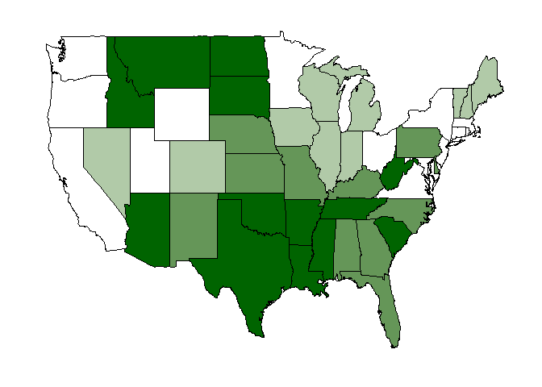

# Traffic Fatality Choropleth Maps
Mike Silva  
November 16, 2015  

## Introduction
I wanted to create some choropleth maps of traffic fatality data.  I pulled the latest data from <http://www.iihs.org/iihs/topics/t/general-statistics/fatalityfacts/state-by-state-overview/2013>.  I will create these maps using R.

## Data Management
The first step was to read and summarize in the data:


```r
library(dplyr)
# Read in the HTS data
hts.fatalities.2013 <- read.csv('hts_fatalities_2013.csv', nrows = 1)
hts.fatalities.2013 <- read.csv('hts_fatalities_2013.csv', colClasses = rep('character', length(hts.fatalities.2013))) %>%
  filter(State != 'U.S. total') %>%
  mutate(Deaths.per.100.000.population = as.numeric(Deaths.per.100.000.population)) %>%
  mutate(Deaths.per.100.million.vehicle.miles.traveled = as.numeric(Deaths.per.100.million.vehicle.miles.traveled)) %>%
  mutate(region = tolower(State))
# Generate summaries
summary(hts.fatalities.2013$Deaths.per.100.000.population)
```

```
##    Min. 1st Qu.  Median    Mean 3rd Qu.    Max. 
##    3.10    7.80   10.90   11.41   14.70   22.60
```

```r
summary(hts.fatalities.2013$Deaths.per.100.million.vehicle.miles.traveled)
```

```
##    Min. 1st Qu.  Median    Mean 3rd Qu.    Max. 
##   0.560   0.940   1.080   1.130   1.335   1.960
```

Deaths per 100 million vehicle miles traveled is roughly one-tenth the size of the deaths per 100,000 million population.  I want to display this data plus quartiles so I need to add quartiles.


```r
hts.fatalities.2013$miles.quartile <- with(hts.fatalities.2013, cut(Deaths.per.100.million.vehicle.miles.traveled,  breaks=quantile(Deaths.per.100.million.vehicle.miles.traveled), include.lowest=TRUE))

hts.fatalities.2013$pop.quartile <- with(hts.fatalities.2013, cut(Deaths.per.100.000.population,  breaks=quantile(Deaths.per.100.000.population), include.lowest=TRUE))
```

## Visualizations


### Deaths per 100,000  

 

### Deaths per 100 Million Miles  

 

### Deaths per 100,000 Quartiles  

 

### Deaths per 100 Million Miles Quartiles  

 

### All Together  


